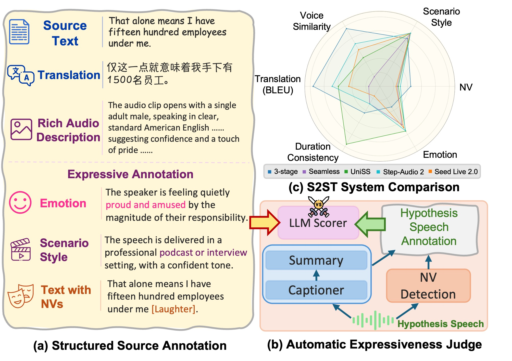
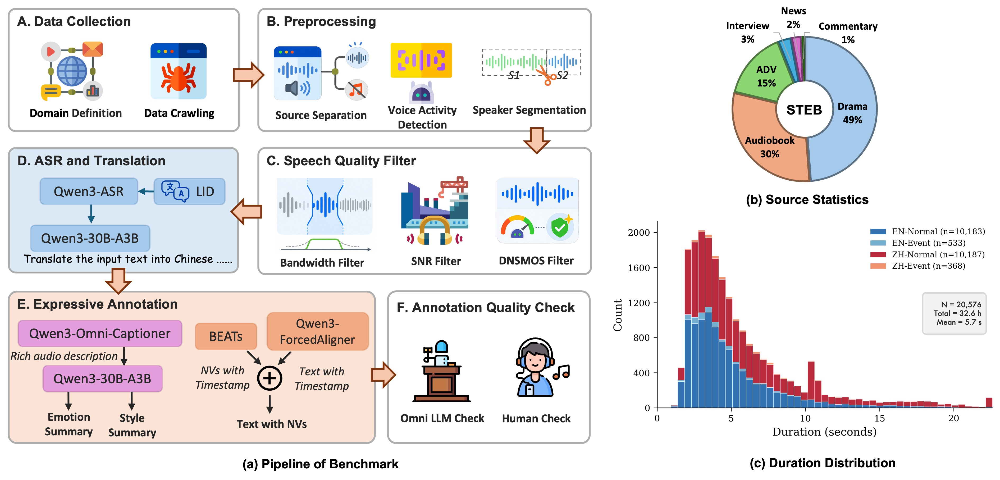

# STEB

Official code release for **STEB**: A Speech-to-Speech Translation Expressiveness Benchmark for Evaluating Beyond Translation Fidelity, an automatic evaluation toolkit for
speech-to-speech translation systems. 


The repository provides the evaluation
pipeline, feature extraction modules, and metric implementations used to score
translation fidelity and **emotion**/**scenario style**/**NV** preservation.

<p align="center">
<a href="https://arxiv.org/pdf/2606.25529"></a>
<a href="https://cmots.github.io/steb.github.io/"></a>
<a href="https://huggingface.co/datasets/cmots/STEB"></a>
</p>

## Overview



*Figure 1. The overview of STEB benchmark and performance of S2ST systems.*

STEB evaluates speech-to-speech translation outputs from both text and audio
signals. Given benchmark metadata, reference annotations, and model-generated
hypothesis audio, the pipeline builds unified evaluation records, extracts
hypothesis-side audio features, and reports sentence-level and corpus-level
scores.


## Highlights

- Speech Fidelity: BLEU, COMET, XCOMET, ASR-BLEU, ASR-COMET, etc.
- Expressiveness Preservation: Emotion, Scenario Style, NVs
- A Caption-then-summarize method: LALM-as-a-judge and rubrics for expressive S2ST

## Repository Structure

```text
STEB/
|-- core_functional_modules/
|   |-- captioner/              # Caption and emotion/style feature clients
|   |-- extract_timestamp/      # ASR timestamp extraction and event merging
|   |-- PretrainedSED/          # BEATs sound event detection wrapper
|   `-- utils/                  # Parquet, task, and vLLM client utilities
|-- evaluation/
|   |-- eval/                   # Data loading, feature merging, and scorers
|   |-- run_eval.sh             # End-to-end evaluation entry point
|   `-- service_orchestrator.sh # Local vLLM service lifecycle helpers
|-- requirements.txt
`-- README.md
```

## Installation

The current release focuses on the automatic evaluation code and provides a
`uv`-based setup for the default vLLM-backed evaluation workflow.

From a fresh clone, install `uv` following
the official instructions, then let `uv` create and manage the project
environment:

```bash
uv sync --python 3.10
uv run python -c "import torch, torchaudio, vllm, pandas, sacrebleu; print('STEB environment OK')"
```

The default environment includes `vllm==0.23.0`, `qwen-omni-utils`, and the
BEATs / PretrainedSED runtime dependencies used for non-verbal (NV) sound-event
extraction, because the default evaluation keeps BLEU, emotion, style, NV, and
SLC enabled while leaving speaker similarity and COMET/XCOMET disabled unless
explicitly run in their optional environments.

For platforms that need a specific PyTorch wheel, install the matching PyTorch
build first with `uv pip install`, then synchronize the remaining project
dependencies. Choose the index URL from the official PyTorch installation
selector for your operating system, Python version, and accelerator:

```bash
uv venv --python 3.10
uv pip install torch torchaudio --index-url <pytorch-wheel-index-url>
uv sync
```

The project dependencies are maintained with `uv add`. You only need these
commands when changing STEB's dependency set, not for normal installation:

```bash
uv init --bare --python 3.10
uv add aiohttp dcase-util librosa numpy pandas pyarrow qwen-omni-utils requests sacrebleu scipy sed-scores-eval soundfile torch torchaudio tqdm transformers vllm==0.23.0 zhconv zhon
uv add --optional speaker-sim fairseq==0.12.2 fire omegaconf packaging s3prl==0.3.1
```

Install the optional speaker-sim dependency group only if you want to build the
isolated speaker-sim environment from the project metadata:

```bash
uv sync --extra speaker-sim
```

### Optional Environment Installation
Optional COMET/XCOMET and speaker-similarity workflows require isolated environments
because their upstream dependencies conflict with the modern vLLM stack.
You can install these envs follow [optional install.md](docs/install_optional.md)

## Data Format

Benchmark JSONL rows should contain source/reference fields:

```json
{
  "id": "sample_001",
  "text": "source transcript",
  "text_with_events": "source transcript [Laughter]",
  "translation": {"en": "reference translation"},
  "emotion": "...cheerful...",
  "style": "...audiobook narration...",
  "caption": "reference audio caption",
  "wav_path": "/path/to/reference.wav"
}
```

Result JSONL rows should contain hypothesis fields:

```json
{
  "id": "sample_001",
  "hyp_text": "Translation with sound events: ...",
  "hyp_wav_path": "/path/to/hypothesis.wav",
  "model_name": "my_model",
  "error": null
}
```

## Running Evaluation

The main entry point is `evaluation/run_eval.sh`. All dataset, output, and
model paths are configured through environment variables:

```bash
BENCHMARK_FILE=/path/to/benchmark.jsonl \
RESULTS_FILE=/path/to/results.jsonl \
OUTPUT_DIR=/path/to/eval_output \
SPLIT=normal \
SRC_LANG=zh \
TGT_LANG=en \
ASR_MODEL_PATH=/path/to/Qwen3-ASR-1.7B \
ALIGNER_MODEL_PATH=/path/to/Qwen3-ForcedAligner-0.6B \
QWEN3_CAPTION_MODEL_PATH=/path/to/Qwen3-Omni-Captioner \
QWEN3_INSTRUCT_MODEL_PATH=/path/to/Qwen3-Instruct \
ENABLE_LLM=--enable_llm \
bash evaluation/run_eval.sh
```

For event-bearing samples, set `SPLIT=event`. Phase 2 will run BEATs sound
event detection and event combination before scoring.

Useful switches:

- `START_PHASE=3 END_PHASE=3` runs scoring only from existing eval records.
- `ENABLE_COMET=--enable_comet BASE_COMET_MODEL=/path/or/hf/id` enables optional
  COMET scoring from a separate COMET environment.
- `ENABLE_XCOMET=--enable_xcomet XCOMET_MODEL=/path/or/hf/id` enables optional
  XCOMET scoring from a separate COMET environment.
- `ENABLE_SPEAKER_SIM=--enable_speaker_sim` enables optional speaker similarity
  scoring from the isolated speaker-sim environment.
- `AUTO_START_CAPTION_SERVERS=0 CAPTION_SERVER_URLS=http://host:port/v1` uses
  manually launched caption servers.
- `AUTO_START_INSTRUCT_SERVERS=0 INSTRUCT_SERVER_URLS=http://host:port/v1` uses
  manually launched instruct servers.

Outputs are written under `OUTPUT_DIR`:

- `eval_records.jsonl`
- `eval_records_merged.jsonl`
- `eval_results_<model>.jsonl`
- `eval_summary_<model>.json`
- per-phase logs under `logs/`

## Metrics

The default pipeline reports:

- **Text translation:** BLEU.
- **Speech timing:** duration ratio and SLC.
- **Paralinguistic consistency:** LLM emotion, scenario style, and non-verbal (NV) sound-event judges.

Optional environments can additionally report:

- **Text translation:** COMET/XCOMET.
- **Speaker preservation:** UniSpeech speaker similarity.

## Benchmark Dataset

The benchmark dataset will be released on [Huggingface](https://huggingface.co/datasets/cmots/STEB). Now, we have to review data to provide high-quality versions to the community. However, we invite researchers to use our pipeline to generate expressive S2ST data. Full details are provided in [our paper](https://arxiv.org/pdf/2606.25529).


*Figure 2. The pipeline and overview of STEB dataset.*

## Citation
If you find our paper and code useful in your research, please consider giving a star and citation.

```bibtex
@misc{cheng2026steb,
      title={STEB: A Speech-to-Speech Translation Expressiveness Benchmark for Evaluating Beyond Translation Fidelity}, 
      author={Sitong Cheng and Weizhen Bian and Songjun Cao and Jin Li and Bei Liu and Chunyang Jiang and Yike Zhang and Weihao Wu and Yiming Li and Chi-Min Chan and Long Ma and Wei Xue},
      year={2026},
      eprint={2606.25529},
      archivePrefix={arXiv},
      primaryClass={cs.SD},
      url={https://arxiv.org/abs/2606.25529}, 
}
```
